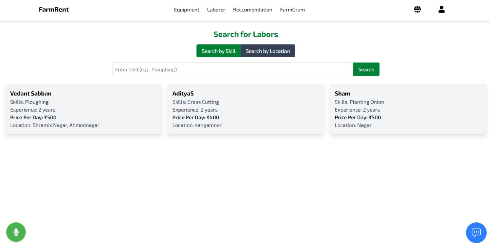
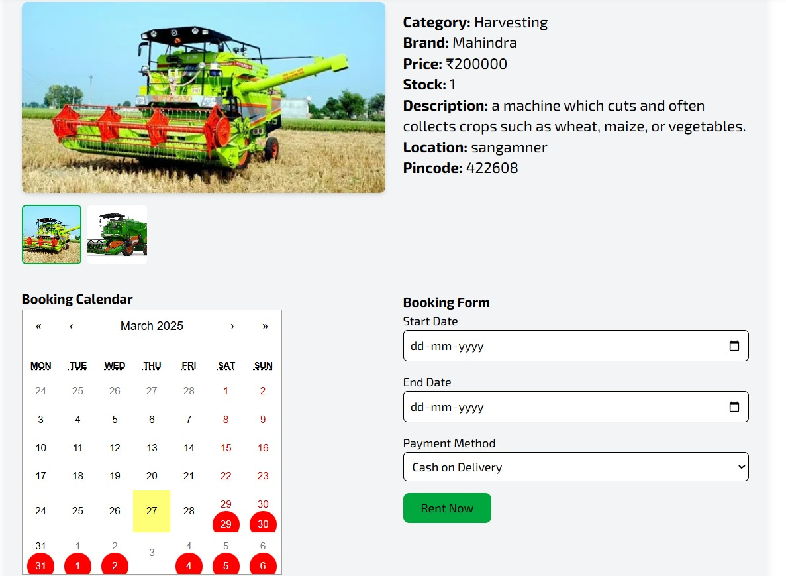

A modern web application built with **React**, **Vite**, and **Tailwind CSS** for renting farm equipment and hiring agricultural labor. Includes an integrated **Google Gemini Chatbot Assistant** for seamless support and guidance.

---

## 📦 Features

- 🌾 **Browse & Rent Equipment** – Easily search and rent a variety of farming equipment.
- 👨‍🌾 **Hire Labour** – Book skilled farm workers as per your needs.
- 🧠 **Google Gemini Chatbot Assistant** – Get instant help and recommendations from the AI assistant.
- ⚡ **Fast & Lightweight** – Built using Vite for super-fast development and build speed.
- 🎨 **Tailwind CSS** – Sleek, responsive, and fully customizable UI.
- 🌎 **Multi-lingual Support** - Supports two languages english and marathi.

---

## 🚀 Getting Started

Follow these steps to set up the project on your local machine.

### 1. Clone the Repository

```bash
git clone https://github.com/your-username/farm-equipment-rental.git
cd farm-equipment-rental
```

### 2. Install Dependencies

```bash
npm install
```

### 3. Start the Development Server

```bash
npm run dev
```

That's it! You're ready to explore the app on `http://localhost:5173`.

---

## 🛠️ Tech Stack

- **React** – Component-based UI library
- **Vite** – Next-gen front-end build tool
- **Tailwind CSS** – Utility-first CSS framework
- **Google Gemini AI** – Integrated AI chatbot assistant

---


## 🤖 Google Gemini Chatbot Assistant

The Gemini chatbot is embedded within the app to assist users with:

- Navigating the platform
- Equipment/labour recommendations
- Rental support and help queries

It is available on every page via a floating chat icon.

---

## 📸 Screenshots

## 📸 Screenshots

### 🏠 Homepage


### 👨‍🌾 Hire Labour Page


### 👨‍🌾 Book Equipments Page


---

## 🧑‍💻 Contributing

Contributions are welcome! Feel free to fork the repo, make changes, and submit a PR.

---

## 📜 License

This project is open source and available under the [MIT License](LICENSE).

---
